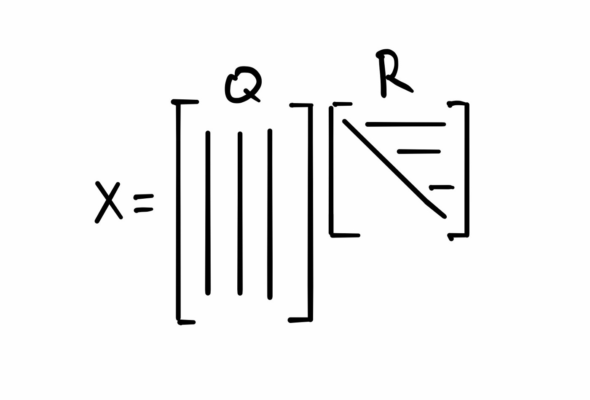

# QR Decomposition

### Intro
QR decomposition (factorization) is decomposition of a matrix into orthogonal (Q) and upper triangular (R) matrices. QR factorization is used in solving linear least
square problems and finding eigenvalues.

[This post shows how QR decomposition is computed and how to use it to solve practical problems.](https://ristohinno.medium.com/qr-decomposition-903e8c61eaab)

  

