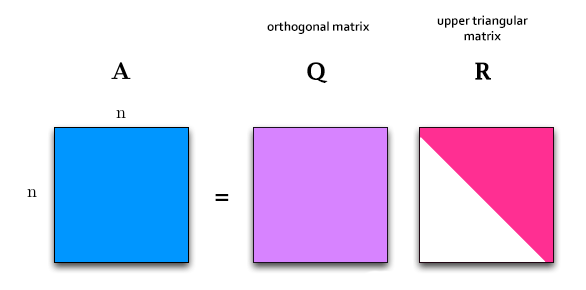

# QR Decomposition

In linear algebra, a QR decomposition, also known as a QR factorization or QU factorization, is a decomposition of a matrix A into a product A = QR of an orthogonal matrix Q and an upper triangular matrix R.

